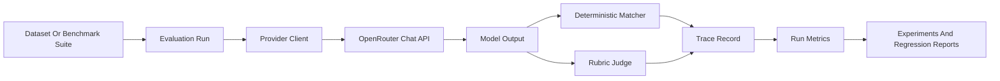

# Architecture

## Runtime Flow

## Backend Boundaries

- `routers/` exposes FastAPI endpoints and handles request validation.
- `services/provider_client.py` isolates OpenRouter request and response handling.
- `services/llm_judge.py` owns rubric prompting, LLM-as-judge parsing, fallback judging, and pairwise comparisons.
- `services/answer_matchers.py` provides deterministic expected-answer checks.
- `services/benchmark_suites.py` contains curated portfolio demo benchmarks.
- `services/metrics.py` aggregates successful traces while excluding failed items.
- `services/migrations.py` keeps SQLite schemas forward-compatible for local portfolio demos.

## Reliability Choices

- Evaluation runs track progress and cancellation state.
- Each run and result can carry a trace ID.
- Provider failures are stored on individual result rows instead of crashing aggregate reporting.
- The local fallback judge keeps demos usable without a live OpenRouter key.
- The frontend can run through Docker Compose or standard local dev commands.
